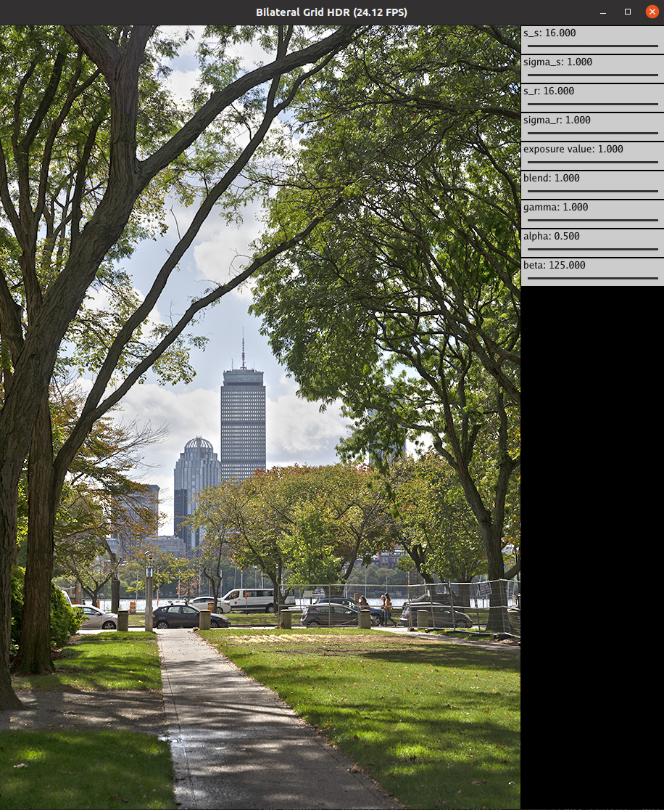

# (GPU) Image processing with Taichi

### Enforcing code format

We use the `pre-commit` Python package, which invokes `yapf` automatically format Python code.

Usage:
1. Install `pre-commit`: `pip install pre-commit`.
2. Run code format: `pre-commit run -a`.
3. Install as pre-commit hook: `pre-commit install`.
